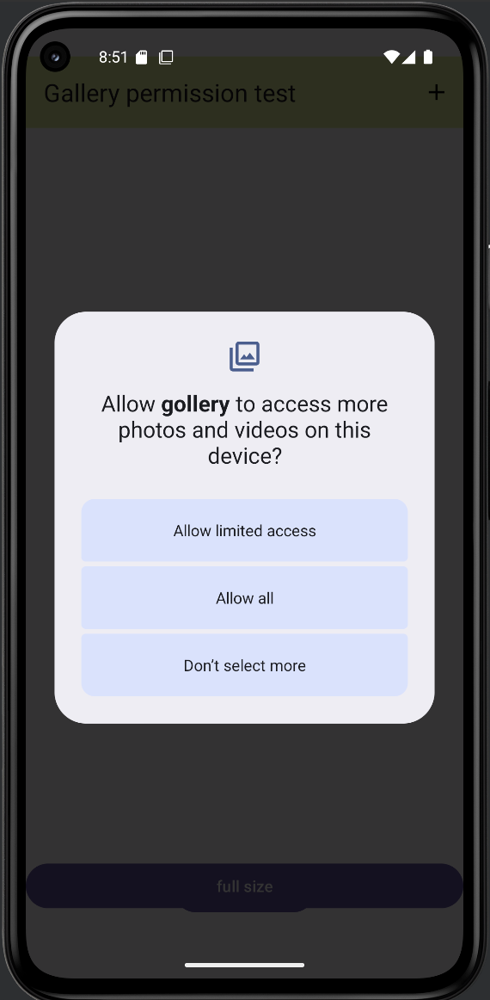
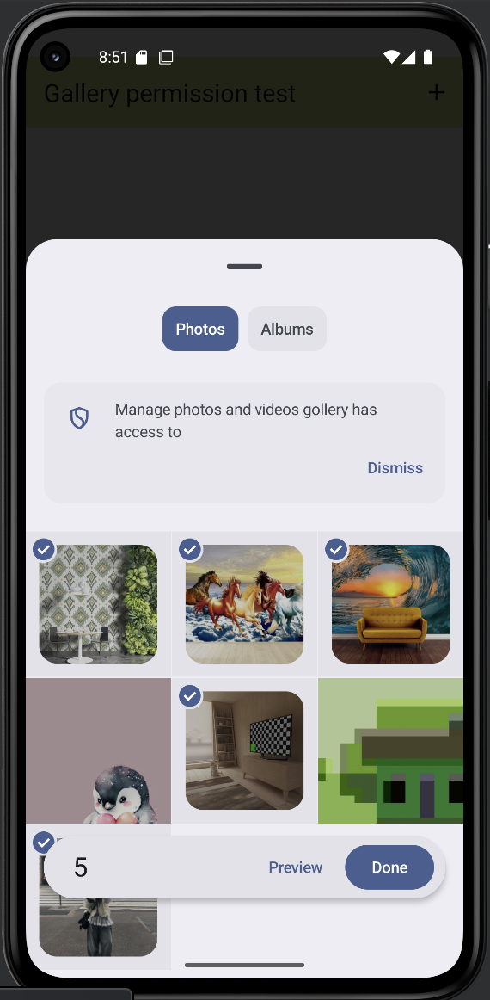
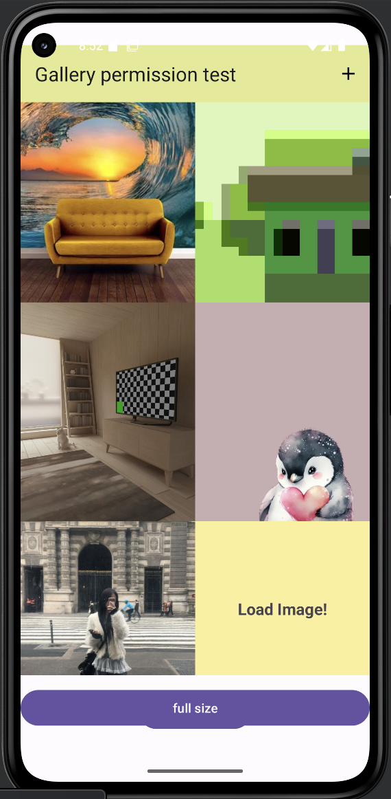
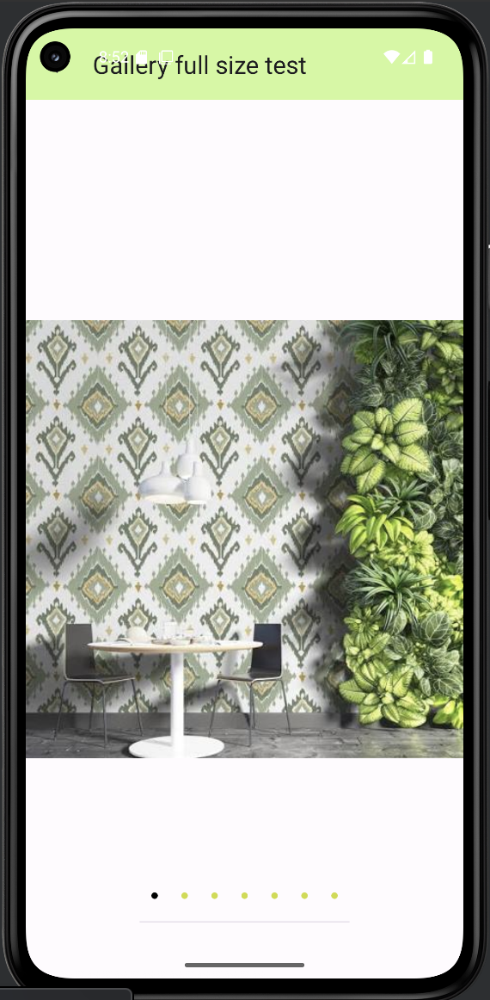

# 📸 Gollery App
*(Android Gallery Application made with Kotlin)*

---

## 🇬🇧 English

### 🧩 Overview
**Gollery** is a simple Android gallery app built with **Kotlin**, featuring:
- 📂 Runtime permission requests
- 🖼️ Image display with `RecyclerView` and `ListAdapter`
- ➕ “Load More” and “Add Images” functions
- 📲 Swipe navigation using `ViewPager2`
- 📷 Screenshot support

This project is a clean example for Android beginners learning how to handle image loading, permissions, and RecyclerView adapters in Kotlin.

---

### ⚙️ Tech Stack
- Language: **Kotlin**
- Architecture: Simple Activity + Adapter structure
- UI: **RecyclerView**, **ViewPager2**, **ViewBinding**
- Permission Handling: `ActivityResultContracts.RequestPermission`
- Min SDK: **26+**

---
### 📷 Screenshot


<p align="center">
  
  
  
  
</p>


### 🚀 How to Run
1. Clone this repository:
   ```bash
   git clone https://github.com/ismoil201/gollery.git
   cd gollery
